# Quranic Balaghah Analysis System - Complete Architecture

This document provides a comprehensive overview of the entire Quranic balaghah analysis system, from raw data sources through processing, extraction, LLM-guided analysis, to final structured output.

---

## System Overview: 7-Layer Architecture

```mermaid
flowchart TB
    subgraph RAW["1. RAW DATA SOURCES"]
        direction TB
        S1["sources/quranic-corpus-full/<br/>- quranic-corpus-morphology-full.txt<br/>- quran-morphology-github.txt<br/>- quranic-corpus-dependencies-full.txt<br/>- quranic-corpus-named-entities-full.txt<br/>- quranic-corpus-lemmas.txt<br/>- quranic-corpus-pause-marks.txt"]
        S2["sources/tanzil/<br/>jqurantree/src/resources/tanzil/<br/>quran-uthmani.xml"]
        S3["sources/tafseer/<br/>Al_Qushairi_Tafsir_tafseer.csv"]
        S4["sources/asbabun_nuzul/<br/>asbabun_nuzul.md"]
        S5["sources/clear_quran_full_text.txt"]
        S6["API Sources:<br/>- Quran.com API (Maududi Tafhim)<br/>- AlQuran Cloud API (rukus)<br/>- Tanzil.net (revelation order)<br/>- spa5k/tafsir_api (Ibn Kathir)"]
        S7["sources/lanes-lexicon-roots.txt<br/>sources/quranic-root-words-lanes-lexicon.txt"]
    end

    subgraph CONVERT["2. CONVERSION SCRIPTS"]
        direction TB
        C1["convert_github_morphology.py<br/>Input: quran-morphology-github.txt<br/>Output: morphology_segments.json<br/>39.4 MB, 130,030 segments"]
        C2["build_morphology_aligned.py<br/>flatten_morphology_aligned.py<br/>Creates: morphology_aligned.json"]
        C3["fetch_surah_info.py<br/>Fetches: Ibn Kathir introductions<br/>Output: surah_info.json (90.9 KB)<br/>+ ruku_divisions.json (89.2 KB)"]
        C4["fetch_quran_com_context.py<br/>Fetches: Maududi's Tafhim<br/>Output: surah_context_qurancom.json<br/>944 KB, comprehensive"]
        C5["parse_clear_quran_sections.py<br/>Input: clear_quran_full_text.txt<br/>Output: clear_quran_sections.json<br/>1,966 section headings"]
        C6["parse_lanes_lexicon.py<br/>map_roots_to_arabic.py<br/>Output: lanes_lexicon_roots.json<br/>+ root_meanings.json (395 KB)"]
        C7["Built-in converters:<br/>- Dependencies (TXT → JSON)<br/>- Named entities (TXT → JSON)<br/>- Lemmas dictionary (TXT → JSON)<br/>- Pause marks (TXT → JSON)<br/>- Tafsir (CSV → JSON)<br/>- Asbab nuzul (MD → JSON)"]
    end

    subgraph PROCESSED["3. PROCESSED DATA (data/)"]
        direction TB
        subgraph LING["data/linguistic/"]
            P1["morphology_segments.json<br/>39.4 MB, 130,030 segments<br/>RECOMMENDED format"]
            P2["morphology_full.json<br/>22.6 MB, legacy format"]
            P3["dependencies_full.json<br/>8.3 MB, 37,420 relations"]
            P4["named_entities_full.json<br/>0.8 MB, 5,494 entities"]
            P5["lemmas_dictionary.json<br/>0.2 MB, 1,593 lemmas"]
            P6["pause_marks.json<br/>0.5 MB, 4,359 marks"]
            P7["root_meanings.json<br/>395 KB, Lane's Lexicon"]
            P8["balaghah_tier1.json<br/>13.7 MB (saj', takrar)"]
            P9["balaghah_tier2.json<br/>7.1 MB (ma'ani)"]
            P10["balaghah_advanced.json<br/>19.2 MB (iltifat, etc.)"]
            P11["tibaq_antonym_pairs.json<br/>25.5 KB"]
        end
        subgraph TEXT["data/text/"]
            P12["quran_text.json<br/>3.8 MB, 114 chapters<br/>6,236 verses"]
            P13["translation_en.json<br/>English translations"]
        end
        subgraph META["data/metadata/"]
            P14["chapter_metadata.json<br/>24 KB, 114 chapters"]
            P15["surah_context_qurancom.json<br/>944 KB, Maududi Tafhim<br/>PRIMARY SOURCE"]
            P16["revelation_order.json<br/>14 KB, Tanzil data"]
            P17["surah_info.json<br/>90.9 KB, Ibn Kathir<br/>SUPPLEMENTARY"]
            P18["ruku_divisions.json<br/>89.2 KB, 556 rukus"]
            P19["clear_quran_sections.json<br/>~500 KB, 1,966 sections<br/>3.1 verses/section avg"]
            P20["tafsir_index.json<br/>64 KB, Al-Qushairi"]
            P21["asbab_nuzul_index.json<br/>1.7 MB, 678 verses"]
        end
        P22["quran_comprehensive.json<br/>ALL DATA MERGED<br/>Used by get_verse_info_v2.py"]
    end

    subgraph TOOLS["4. DATA EXTRACTION TOOLS"]
        direction TB
        T1["generate_comprehensive_quran.py<br/>MERGES ALL DATA:<br/>- Text + Morphology<br/>- Dependencies + Entities<br/>- Balaghah (tier1 + tier2 + advanced)<br/>- All metadata<br/>Output: quran_comprehensive.json"]
        T2["get_verse_info_v2.py<br/>MAIN EXTRACTOR<br/>Input: quran_comprehensive.json<br/>Loads: lemmas, dependencies,<br/>entities, pause marks, roots<br/>Detects: taqdim, tibaq, tashbih<br/>Output: verse_X_Y_v2.json"]
        T3["Balaghah Detectors:<br/>- taqdim_detector.py<br/>- tibaq_detector.py<br/>- tashbih_detector.py"]
        T4["balaghah_to_text.py<br/>Converts structured data<br/>to natural language"]
        T5["metadata_loader.py<br/>Unified data loader"]
    end

    subgraph GUIDE["5. LLM ANALYSIS GUIDE"]
        direction TB
        G1["balaghah_quick_reference_v2b_streamlined.md<br/>824 lines (73% reduction from 3,058)<br/><br/>CORE SECTIONS:<br/>1. Foundational Concept: Munasabat<br/>2. JSON Data Structure<br/>3. Balaghah Devices Guide<br/>4. Analysis Framework"]
        G2["ENHANCEMENT HISTORY:<br/><br/>v1 → v2 → v2 comparative → v2b → v2b_streamlined"]
        G3["5 MAJOR IMPROVEMENTS:<br/><br/>1. Mandatory Asbab al-Nuzul Analysis<br/>2. Ban Generic Statements<br/>3. Prevent Redundant Phonetics<br/>4. Nouman Ali Khan Life Connections<br/>5. Evidence-Based Claims Only"]
    end

    subgraph ANALYSIS["6. LLM ANALYSIS FLOW"]
        direction TB
        A1["INPUT TO LLM:<br/>verse_X_Y_v2.json<br/>+<br/>balaghah_quick_reference_v2b_streamlined.md"]
        A2["LLM RECEIVES:<br/>- Verse text (Arabic + English)<br/>- Morphology (word-level simplified)<br/>- Balaghah features (saj', takrar, etc.)<br/>- Root repetitions WITH full context<br/>- Section headings<br/>- Asbab al-Nuzul (if available)<br/>- Tafsir commentary<br/>- Chapter introduction"]
        A3["LLM FOLLOWS GUIDE:<br/>1. Read section headings first<br/>2. Check revelation context<br/>3. Apply balaghah analysis framework<br/>4. Connect to asbab al-Nuzul<br/>5. Explore root theological threads<br/>6. Synthesize all features"]
    end

    subgraph OUTPUT["7. LLM OUTPUT STRUCTURE"]
        direction TB
        O1["SECTION 1: Chapter Opening<br/>5 PARTS:<br/>1. Surah Identity & Context<br/>2-3. Message & Architecture<br/>4. How Rhetoric Serves Message<br/>5. Divine Inimitability"]
        O2["SECTION 2: Verse-by-Verse<br/>FOR EACH VERSE:<br/><br/>Para 1: Sonic Experience<br/>Para 2: Conceptual Threads<br/>Para 3: Grammatical Architecture<br/>Para 4: Advanced Rhetorical Layers<br/>Para 5: Unified Effect"]
        O3["+ WORD-LEVEL PRECISION:<br/>- Historical context (asbab)<br/>- Root meaning<br/>- Grammatical precision<br/>- Synonym analysis"]
        O4["+ REFLECTION (NAK-style):<br/>- Practical life connection<br/>- Modern relevance<br/>- Behavioral implications"]
    end

    %% Main flow connections
    S1 --> C1
    S1 --> C7
    S2 --> C7
    S3 --> C7
    S4 --> C7
    S5 --> C5
    S6 --> C3
    S6 --> C4
    S7 --> C6

    C1 --> P1
    C2 --> P2
    C3 --> P17
    C3 --> P18
    C4 --> P15
    C5 --> P19
    C6 --> P7
    C7 --> P3
    C7 --> P4
    C7 --> P5
    C7 --> P6
    C7 --> P12
    C7 --> P14
    C7 --> P20
    C7 --> P21

    P1 --> T1
    P3 --> T1
    P4 --> T1
    P8 --> T1
    P9 --> T1
    P10 --> T1
    P12 --> T1
    P13 --> T1
    P14 --> T1
    P15 --> T1
    P16 --> T1
    P17 --> T1
    P18 --> T1
    P19 --> T1
    P20 --> T1
    P21 --> T1

    T1 --> P22
    P22 --> T2
    P5 --> T2
    P3 --> T2
    P4 --> T2
    P6 --> T2
    P7 --> T2
    T3 --> T2
    T4 --> T2
    T5 --> T2

    T2 --> A1
    G1 --> A1
    G2 -.-> G1
    G3 -.-> G1

    A1 --> A2
    A2 --> A3
    A3 --> O1
    A3 --> O2
    A3 --> O3
    A3 --> O4

    style RAW fill:#e1f5ff
    style CONVERT fill:#fff4e1
    style PROCESSED fill:#e8f5e9
    style TOOLS fill:#f3e5f5
    style GUIDE fill:#fff9c4
    style ANALYSIS fill:#ffe0b2
    style OUTPUT fill:#ffccbc

    style P15 stroke:#ff0000,stroke-width:3px
    style P19 stroke:#ff0000,stroke-width:3px
    style T2 stroke:#ff0000,stroke-width:3px
    style G1 stroke:#ff0000,stroke-width:3px
```



---

## Layer 1: Raw Data Sources

### Quranic Corpus (6 files)
Location: `sources/quranic-corpus-full/`

1. **quran-morphology-github.txt** (NEW, RECOMMENDED)
   - Unicode Arabic with full diacritics
   - 130,030 morphological segments
   - Hierarchical: chapter:verse:word:segment
   - Explicit verb forms, mood markers

2. **quranic-corpus-morphology-full.txt** (LEGACY)
   - Buckwalter transliteration
   - Pre-parsed fields
   - Kept for backward compatibility

3. **quranic-corpus-dependencies-full.txt**
   - 37,420 syntactic relations
   - 47 relation types (subject, object, adjective, etc.)

4. **quranic-corpus-named-entities-full.txt**
   - 5,494 semantic concept annotations
   - Top: Allah (2,721), earth (409), Musa (136)

5. **quranic-corpus-lemmas.txt**
   - 1,593 unique lemmas
   - Buckwalter + Unicode + English

6. **quranic-corpus-pause-marks.txt**
   - 4,359 tajweed pause annotations

### Tanzil Project
Location: `jqurantree/src/main/resources/tanzil/`

**quran-uthmani.xml**
- Complete Uthmani text
- 114 chapters, 6,236 verses
- Embedded in JQuranTree library

### Tafsir Collections
Location: `sources/tafseer/`

**Al_Qushairi_Tafsir_tafseer.csv**
- Al-Qushairi Sufi commentary
- 45 verses with English translation

### Asbab al-Nuzul
Location: `sources/asbabun_nuzul/`

**asbabun_nuzul.md**
- Occasions of revelation
- 678 verses with 1,335 occasion entries

### Clear Quran
Location: `sources/`

**clear_quran_full_text.txt**
- Source for section headings extraction
- Dr. Mustafa Khattab's thematic divisions

### API Sources (4 APIs)

1. **Quran.com API** (PRIMARY)
   - Maududi's Tafhim al-Quran
   - 114 chapters with comprehensive introductions
   - Avg ~8000 chars each
   - Fetcher: `fetch_quran_com_context.py`

2. **AlQuran Cloud API**
   - Ruku divisions metadata
   - 556 traditional thematic sections

3. **Tanzil.net**
   - Revelation order data
   - Based on Ibn Abbas narrations

4. **spa5k/tafsir_api**
   - Ibn Kathir tafsir introductions
   - Supplementary to Quran.com

### Lane's Lexicon
Location: `sources/`

**lanes-lexicon-roots.txt**
**quranic-root-words-lanes-lexicon.txt**
- Classical Arabic root meanings
- Etymology data

---

## Layer 2: Conversion Scripts

Location: `scripts/converters/`

### 1. convert_github_morphology.py
**Purpose**: Convert new GitHub morphology format to hierarchical JSON

**Input**: `quran-morphology-github.txt` (TSV format)

**Output**: `data/linguistic/morphology_segments.json` (39.4 MB)

**Features**:
- 130,030 segments with Unicode Arabic
- Explicit verb forms (VF:1-10)
- Complete feature set
- Hierarchical structure: chapter → verse → word → segments

### 2. build_morphology_aligned.py + flatten_morphology_aligned.py
**Purpose**: Align morphology with Quranic text

**Output**: `morphology_aligned.json` (intermediate)

### 3. fetch_surah_info.py
**Purpose**: Fetch chapter introductions and ruku divisions

**Sources**:
- spa5k/tafsir_api (Ibn Kathir)
- AlQuran Cloud API (rukus)

**Outputs**:
- `data/metadata/surah_info.json` (90.9 KB)
- `data/metadata/ruku_divisions.json` (89.2 KB, 556 rukus)

### 4. fetch_quran_com_context.py (PRIMARY)
**Purpose**: Fetch Maududi's Tafhim al-Quran

**Source**: Quran.com API (`https://api.quran.com/api/v4/chapters/{id}/info`)

**Output**: `data/metadata/surah_context_qurancom.json` (944 KB)

**Content**:
- 114 chapters with comprehensive introductions
- Period and circumstances of revelation
- Historical background
- Thematic structure with verse ranges
- Major themes and rhetorical purposes

### 5. parse_clear_quran_sections.py
**Purpose**: Extract thematic section headings

**Input**: `clear_quran_full_text.txt`

**Output**: `data/metadata/clear_quran_sections.json` (~500 KB)

**Content**:
- 1,966 section headings across 113 chapters
- 99.2% coverage (missing only Chapter 14)
- Avg 3.1 verses per section
- Descriptive English headings

### 6. parse_lanes_lexicon.py + map_roots_to_arabic.py
**Purpose**: Extract root meanings from Lane's Lexicon

**Output**: `data/linguistic/root_meanings.json` (395 KB)

### 7. Built-in Converters
Various scripts converting TXT/CSV/MD to JSON:
- Dependencies converter
- Named entities converter
- Lemmas dictionary converter
- Pause marks converter
- Tafsir CSV converter
- Asbab nuzul MD converter

---

## Layer 3: Processed Data

Location: `data/`

### data/linguistic/ (11 files)

1. **morphology_segments.json** (39.4 MB) ⭐ RECOMMENDED
   - 130,030 segments
   - Unicode Arabic with diacritics
   - Hierarchical structure
   - Source: quran-morphology-github.txt

2. **morphology_full.json** (22.6 MB)
   - 77,429 entries
   - Buckwalter transliteration
   - Legacy format

3. **dependencies_full.json** (8.3 MB)
   - 37,420 syntactic relations
   - 47 relation types

4. **named_entities_full.json** (0.8 MB)
   - 5,494 semantic entities

5. **lemmas_dictionary.json** (0.2 MB)
   - 1,593 unique lemmas

6. **pause_marks.json** (0.5 MB)
   - 4,359 tajweed marks

7. **root_meanings.json** (395 KB)
   - Lane's Lexicon root meanings

8. **balaghah_tier1.json** (13.7 MB)
   - Saj' (rhyme) patterns
   - Takrar (repetition) detection

9. **balaghah_tier2.json** (7.1 MB)
   - Ilm al-Ma'ani features
   - Word order, sentence types

10. **balaghah_advanced.json** (19.2 MB)
    - Iltifat (grammatical shifts)
    - Muqabala (parallelism)
    - Advanced devices

11. **tibaq_antonym_pairs.json** (25.5 KB)
    - Detected antonym pairs

### data/text/ (2 files)

1. **quran_text.json** (3.8 MB)
   - 114 chapters, 6,236 verses
   - Unicode Uthmani text
   - Source: Tanzil XML

2. **translation_en.json**
   - English translations

### data/metadata/ (8 files)

1. **chapter_metadata.json** (24 KB)
   - 114 chapters
   - Arabic names, Meccan/Medinan, revelation order

2. **surah_context_qurancom.json** (944 KB) ⭐ PRIMARY
   - Maududi's Tafhim al-Quran
   - Comprehensive chapter introductions
   - Historical context, thematic structure

3. **revelation_order.json** (14 KB)
   - Chronological sequence
   - Tanzil.net data

4. **surah_info.json** (90.9 KB)
   - Ibn Kathir introductions
   - Supplementary to Quran.com

5. **ruku_divisions.json** (89.2 KB)
   - 556 traditional sections
   - 11.2 verses per ruku avg

6. **clear_quran_sections.json** (~500 KB) ⭐ CRITICAL
   - 1,966 detailed sections
   - 3.1 verses per section avg
   - Thematic architecture

7. **tafsir_index.json** (64 KB)
   - 45 verses with Al-Qushairi tafsir

8. **asbab_nuzul_index.json** (1.7 MB)
   - 678 verses
   - 1,335 occasion entries

### Comprehensive File

**quran_comprehensive.json**
- ALL data sources merged
- Generated by `generate_comprehensive_quran.py`
- Used by main extractor

---

## Layer 4: Data Extraction Tools

Location: `scripts/tools/`

### 1. generate_comprehensive_quran.py
**Purpose**: Merge all data sources into single file

**Merges**:
- Quran text
- Morphology (segments format)
- Balaghah (tier1 + tier2 + advanced)
- Dependencies
- Named entities
- All metadata

**Output**: `quran_comprehensive.json`

### 2. get_verse_info_v2.py ⭐ MAIN EXTRACTOR
**Purpose**: Extract verse-specific data with live detection

**Input**: `quran_comprehensive.json`

**Additional loads**:
- `lemmas_dictionary.json`
- `dependencies_full.json`
- `named_entities_full.json`
- `pause_marks.json`
- `root_meanings.json`

**Live detection**:
- Taqdim/takhir (word order) via `taqdim_detector.py`
- Tibaq (antithesis) via `tibaq_detector.py`
- Tashbih (simile) via `tashbih_detector.py`

**Natural language conversion**:
- Uses `balaghah_to_text.py` to convert structured data to readable text
- Creates "analysis" field
- Creates "key_words" field

**Output**: `verse_X_Y_v2.json`

**Example usage**:
```bash
cd scripts/tools
echo "70:1-44" | python get_verse_info_v2.py > verse_70_1-44_v2.json
```

### 3. Balaghah Detectors

**taqdim_detector.py**
- Detects word order variations
- VSO vs SVO patterns
- Identifies advanced elements

**tibaq_detector.py**
- Detects antonym pairs
- Classifies opposition types
- Semantic verification

**tashbih_detector.py**
- Detects comparison particles
- Identifies simile components

### 4. balaghah_to_text.py
**Purpose**: Convert structured balaghah data to natural language

**Features**:
- Generates readable "analysis" field
- Extracts "key_words" with meanings
- Makes JSON human-friendly

### 5. metadata_loader.py
**Purpose**: Unified interface for all metadata

**Features**:
- Fast O(1) verse lookups
- Builds lookup maps for ruku and sections
- Single entry point for all metadata

---

## Layer 5: LLM Analysis Guide

Location: `docs/skills/`

### Primary File: balaghah_quick_reference_v2b_streamlined.md

**Size**: 824 lines (73% reduction from 3,058)

**Core Sections**:
1. Foundational Concept: Munasabat (Unity and Coherence)
2. JSON Data Structure (what LLM receives)
3. Balaghah Devices Guide (18+ devices)
4. Analysis Structure (2 sections only)
5. Practical Life Connection (Nouman Ali Khan approach)

### Enhancement History

**Version Evolution**:
1. **v1** - Initial guide with basic balaghah
2. **v2** - Added Ilm al-Ma'ani and Ilm al-Bayan branches
3. **v2 comparative** - Features for analyzing TWO chapters together
4. **v2b** - Integrated all features (3,058 lines)
5. **v2b_streamlined** - 73% reduction + 5 major enhancements (824 lines)

### 5 Major Improvements

#### Enhancement 1: Mandatory Asbab al-Nuzul Analysis ⭐
**Problem**: LLM missed golden connections between historical context and word choices

**Example**:
- Mocker asks for "stones to **fall down**"
- Allah chooses وَاقِع from root و-ق-ع meaning "to **fall down**"
- Connection was not being analyzed

**Solution**:
```markdown
CRITICAL: When `asbab_nuzul` data exists, you MUST analyze how word
choices connect to the historical occasion.

1. Historical Context Connection (REQUIRED if asbab_nuzul exists)
   - Read asbab_nuzul narrative carefully
   - Identify specific details
   - Check if word's root meaning echoes those details
   - Explain irony/precision/prophetic response
```

#### Enhancement 2: Ban Generic Filler Statements ⭐
**Problem**: LLM generated meaningless generic statements

**Bad example** (now banned):
> "This demonstrates Arabic's rich homonymic potential where same trilateral root generates divergent meanings."

**Solution**: Required 4-step root analysis with concrete theological exploration

**Good example** (now required):
> "The root م-ل-ك appears first in verse 4 as ٱلْمَلَٰٓئِكَةُ (angels ascending to Allah) within 'A Mocker Asks for Judgment Day,' then returns in verse 30 as مَلَكَتْ أَيْمَٰنُهُمْ (what their right hands possess) within 'Excellence of the Faithful.' This creates divine-human parallel: angels possess no autonomy—they ascend only to Allah in pure servitude; the faithful possess only what Allah has made lawful..."

#### Enhancement 3: Prevent Redundant Phonetic Analysis ⭐
**Problem**: LLM analyzed consonant clusters in every paragraph

**Solution**:
- Phonetic analysis ONLY in Paragraph 1 (Sonic Experience)
- Focus on saj' ending only
- No repetition in other paragraphs
- Exception: OBVIOUS onomatopoeia only (دُكَّتْ دَكًّا)

#### Enhancement 4: Nouman Ali Khan-Style Life Connection ⭐
**Problem**: Analysis was technical but not practical

**Solution**: Added "Reflection: Relevance to Our Lives" paragraph

**Approach**:
1. Grammatical Choices → Character Lessons
2. Word Choice → Human Psychology
3. Rhetorical Features → Emotional Intelligence

**Example**:
> "The choice of noun 'alhamd' over verb form teaches permanent gratitude versus conditional thanking. When you see a beautiful car, you praise it—you don't thank it. But 'alhamdulillah' is both: recognizing Allah's perfection (praise) AND His gifts (thanks) simultaneously. The noun form means this isn't dependent on our current mood—it's a state of being."

#### Enhancement 5: Evidence-Based Claims Only ⭐
**Problem**: Divine Inimitability section had vague claims without proof

**Bad example** (now banned):
> "The surah accomplishes several goals that would normally conflict: terrify without despairing, promise without diminishing urgency..."

**Solution**: Every claim MUST include:
1. Specific verse numbers
2. Concrete Arabic examples
3. Measurable impossibility
4. Multiple dimensions demonstrated

---

## Layer 6: LLM Analysis Flow

### Input to LLM

**Two files**:
1. `verse_X_Y_v2.json` (structured data)
2. `balaghah_quick_reference_v2b_streamlined.md` (guide)

### What LLM Receives in JSON

```json
{
  "chapter": 70,
  "verse_start": 1,
  "verse_end": 44,
  "metadata": {
    "chapter_number": 70,
    "name_arabic": "ٱلْمَعَارِجِ",
    "revelation_place": "makkah",
    "revelation_order": 79,
    "introduction": "[Maududi's Tafhim - 8000+ chars]",
    "section_headings": {
      "1-7": "A Mocker Asks for Judgment Day",
      "8-18": "Horrors of Judgment Day",
      "19-35": "Excellence of the Faithful",
      "36-44": "Warning to the Mockers"
    }
  },
  "verses": [
    {
      "verse_number": 1,
      "text": "سَأَلَ سَآئِلٌۢ بِعَذَابٍ وَاقِعٍ",
      "translation": "A supplicant asked for a punishment bound to happen",
      "asbab_nuzul": [
        {
          "occasion": "al-Nadr ibn al-Harith said: O Allah! if this be indeed the truth from Thee, then rain down stones on us..."
        }
      ],
      "analysis": "[Natural language balaghah summary]",
      "key_words": "[Root meanings extracted]",
      "root_repetitions": {
        "عذب": {
          "first_occurrence_in_extraction": true,
          "lemmas": ["عَذاب"],
          "total_occurrences_in_chapter": 4,
          "translations": ["punishment"],
          "other_verses": [
            {
              "verse": 11,
              "text": "يُبَصَّرُونَهُمْ يَوَدُّ ٱلْمُجْرِمُ لَوْ يَفْتَدِى مِنْ عَذَابِ يَوْمِئِذٍۭ بِبَنِيهِ",
              "translation": "They will be shown each other. The criminal will wish that he could be ransomed from the punishment of that Day by his children",
              "section_heading": "Horrors of Judgment Day"
            }
          ]
        }
      },
      "balaghah": {
        "saj": {
          "pattern": "ع",
          "sequence_length": 2,
          "position_in_sequence": 1
        },
        "qasam": {
          "particle": "و",
          "sworn_by": "واقِع"
        }
      }
    }
  ]
}
```

### LLM Analysis Process

**Step 1**: Read section headings FIRST
- Understand thematic architecture
- See verse's position in narrative flow

**Step 2**: Check revelation context
- Meccan or Medinan?
- What was the historical situation?
- Who was the audience?

**Step 3**: Read asbab al-Nuzul (if exists)
- What specific event triggered this verse?
- What exact words were said?
- How do word choices connect?

**Step 4**: Apply balaghah analysis framework
- Paragraph 1: Sonic (saj' only)
- Paragraph 2: Roots (with full context from other_verses)
- Paragraph 3: Grammar
- Paragraph 4: Advanced devices
- Paragraph 5: Synthesis

**Step 5**: Word-Level Precision
- MUST connect to asbab_nuzul if exists
- Root meanings
- Grammatical form precision
- Synonym analysis

**Step 6**: Reflection
- Practical modern life connection
- NAK-style questioning approach

---

## Layer 7: LLM Output Structure

### SECTION 1: Chapter Opening (5 Parts)

**Part 1: Surah Identity and Context** (1-2 paragraphs)
- Name, chapter number, verses
- Revelation place/order
- Historical period and audience
- Occasions if available

**Part 2-3: Surah's Message and Architecture** (2-4 paragraphs UNIFIED)
- Central theme or argument
- Rhetorical purpose
- Journey from beginning → end
- How section headings reveal thematic architecture
- Narrative arc through sections
- Major transitions

**Part 4: How Rhetoric Serves Message** (2-4 paragraphs)
- Overall tone and audience appropriateness
- Structural strategy
- General rhetorical approach
- Integration of form and content

**Part 5: Divine Inimitability** (2-3 paragraphs) ⭐
- MUST provide specific verse numbers
- MUST quote concrete Arabic examples
- MUST show measurable impossibility
- MUST demonstrate multiple dimensions

**Example**:
> "Verses 7-14 describe three groups using IDENTICAL grammatical structure (وَأَصْحَابُ...) but phonetically DIVERGENT saj' patterns: verse 8 ends with مَشْأَمَة (mīm), verse 9 with مَيْمَنَة (mīm), verse 11 breaks to مُقَرَّبُونَ (nūn). Acoustic hierarchy emerges—the muqarrabun literally SOUND different. The impossibility: verses 11-26 (muqarrabun description) maintain entirely different phonetic endings from verses 41-56 (companions of left) while keeping thematic coherence..."

### SECTION 2: Verse-by-Verse Analysis

**For EACH verse:**

#### Core Analysis: 5 Continuous Narrative Paragraphs

**Paragraph 1: Sonic Experience**
- Saj' ending and phonetic character
- Position in sequence pattern
- How sound matches content
- What listener experiences
- **ONLY paragraph with phonetic analysis**
- **SKIP common roots: ك-و-ن, ش-ي-ء**

**Paragraph 2: Conceptual Threads Through Roots**
- Read FULL context in other_verses
- Compare section headings
- Explore theological connection
- Why Allah places root in THESE verses?
- Is it contrast? Progression? Echo? Irony?
- **NO generic statements**

**Example**:
> "The root م-ل-ك appears first in verse 4 as ٱلْمَلَٰٓئِكَةُ (angels ascending to Allah) within 'A Mocker Asks for Judgment Day,' then returns in verse 30 as مَلَكَتْ أَيْمَٰنُهُمْ (what their right hands possess) within 'Excellence of the Faithful.' This creates divine-human parallel: angels possess no autonomy—they ascend only to Allah in pure servitude; the faithful possess only what Allah has made lawful. Both uses encode proper relationship to authority: angels to divine command, believers to divine law..."

**Paragraph 3: Grammatical Architecture**
- Verb forms and why chosen
- Definiteness patterns
- Sentence type and purpose
- Why these choices matter

**Paragraph 4: Advanced Rhetorical Layers** (when present)
- Iltifat, hadhf, muqabala, wasl/fasl, qasam
- Woven into narrative (not labeled)
- Semantic opposition verification for muqabala

**Paragraph 5: Unified Effect**
- How all elements work together
- Convergence creating orchestrated system
- What would be lost if any element changed
- **NO repetition of phonetic or root analysis**

#### Word-Level Precision: 1-2 Paragraphs ⭐

**CRITICAL: If asbab_nuzul exists, MUST analyze historical connection**

**8 analytical dimensions**:
1. **Historical Context Connection** (REQUIRED if asbab_nuzul)
   - Read asbab_nuzul carefully
   - Identify specific details (e.g., "rain down stones")
   - Check if root meaning echoes those details
   - Example: وَاقِع root "to fall down" → mocker asked stones to "fall down"

2. **Root Meaning and Etymology**
3. **Grammatical Form Precision**
4. **Phonetic-Semantic Matching** (ONLY obvious onomatopoeia - RARE)
5. **Visual and Physical Imagery**
6. **Temporal/Theological Precision**
7. **Synonym Analysis** (generate alternatives, explain why each fails)
8. **Antonym Analysis** (if present)

**Format**: 1-2 flowing paragraphs, NOT numbered lists

#### Reflection: 1 Paragraph (NAK-style) ⭐

**Connect linguistic features to practical modern life**

**Format**:
1. Start with linguistic feature
2. Connect to universal human experience
3. Give concrete modern example
4. End with practical application

**Example**:
> "The choice of noun 'alhamd' over verb teaches permanent gratitude versus conditional thanking. You praise a beautiful car—don't thank it. You thank someone for a favor. But 'alhamdulillah' is both: recognizing Allah's perfection (praise) AND gifts (thanks). Noun form means it's not mood-dependent—it's a state of being. When your train is late but you catch it, 'alhamdulillah' emerges emotionally. This grammatical choice cultivates optimism and humility as permanent traits, not temporary reactions."

---

## Key Data Flow Paths

### Path 1: Morphology Flow
```
quran-morphology-github.txt (TSV)
    ↓ convert_github_morphology.py
morphology_segments.json (39.4 MB, 130K segments)
    ↓ generate_comprehensive_quran.py
quran_comprehensive.json (ALL DATA MERGED)
    ↓ get_verse_info_v2.py
verse_X_Y_v2.json (verse-specific)
    ↓ + balaghah_quick_reference_v2b_streamlined.md
LLM Analysis → Structured Output
```

### Path 2: Section Headings Flow (CRITICAL) ⭐
```
clear_quran_full_text.txt
    ↓ parse_clear_quran_sections.py
clear_quran_sections.json (1,966 sections)
    ↓ generate_comprehensive_quran.py
quran_comprehensive.json
    ↓ get_verse_info_v2.py
[Adds section_heading to each verse in other_verses]
    ↓
LLM receives section headings for thematic context
```

**Why critical**: Section headings allow root analysis to compare themes across verses, creating theological connections.

### Path 3: Chapter Context Flow (PRIMARY) ⭐
```
Quran.com API
    ↓ fetch_quran_com_context.py
surah_context_qurancom.json (944 KB, Maududi)
    ↓ generate_comprehensive_quran.py
quran_comprehensive.json [metadata.introduction]
    ↓ get_verse_info_v2.py
verse_X_Y_v2.json [metadata.introduction]
    ↓
LLM receives comprehensive chapter introduction
```

### Path 4: Live Detection Flow
```
quran_comprehensive.json
    ↓ get_verse_info_v2.py calls:
        - taqdim_detector.py (word order analysis)
        - tibaq_detector.py (antithesis detection)
        - tashbih_detector.py (simile detection)
    ↓
[Adds live-detected features to balaghah section]
    ↓
verse_X_Y_v2.json
```

### Path 5: Asbab al-Nuzul Flow ⭐
```
asbabun_nuzul.md
    ↓ converter
asbab_nuzul_index.json (678 verses)
    ↓ generate_comprehensive_quran.py
quran_comprehensive.json
    ↓ get_verse_info_v2.py
verse_X_Y_v2.json [asbab_nuzul array]
    ↓
LLM MUST analyze word choices vs historical context
```

---

## File Size Summary

### Total Data Sizes

**data/linguistic/**: ~213 MB
- Largest: morphology_segments.json (39.4 MB)
- Balaghah combined: 40.0 MB (tier1 + tier2 + advanced)
- Dependencies: 8.3 MB
- Named entities: 0.8 MB

**data/text/**: ~3.8 MB
- Quran text: 3.8 MB

**data/metadata/**: ~3.5 MB
- Largest: surah_context_qurancom.json (944 KB)
- Asbab nuzul: 1.7 MB
- Clear Quran sections: ~500 KB

**Total processed data**: ~220 MB

### Critical Files (Red Borders in Diagram) ⭐

1. **surah_context_qurancom.json** (944 KB)
   - PRIMARY source for chapter introductions
   - Maududi's Tafhim al-Quran
   - Comprehensive historical and thematic context

2. **clear_quran_sections.json** (~500 KB)
   - Essential for thematic architecture
   - 1,966 detailed section headings
   - Enables root analysis across themes

3. **get_verse_info_v2.py**
   - Main extraction script
   - Orchestrates all data sources
   - Live balaghah detection

4. **balaghah_quick_reference_v2b_streamlined.md** (824 lines)
   - LLM analysis guide
   - 5 major enhancements
   - 73% reduction from original

---

## Example: Complete Verse Analysis

### Input: verse_70_1-44_v2.json (excerpt)

```json
{
  "chapter": 70,
  "verse_start": 1,
  "verse_end": 44,
  "metadata": {
    "name_arabic": "ٱلْمَعَارِجِ",
    "revelation_place": "makkah",
    "revelation_order": 79,
    "introduction": "The Surah takes its name from the word dhil Ma'arij in verse 3. The subject matter bears evidence that this Surah too was sent down in conditions closely resembling those under which Surah Al Haaqqah was sent down. It admonishes and gives warning to the disbelievers who made fun of the news about Resurrection and the Hereafter...",
    "section_headings": {
      "1-7": "A Mocker Asks for Judgment Day",
      "8-18": "Horrors of Judgment Day",
      "19-35": "Excellence of the Faithful",
      "36-44": "Warning to the Mockers"
    }
  },
  "verses": [
    {
      "verse_number": 1,
      "text": "سَأَلَ سَآئِلٌۢ بِعَذَابٍ وَاقِعٍ",
      "translation": "A supplicant asked for a punishment bound to happen",
      "asbab_nuzul": [
        {
          "occasion": "This verse was revealed about al-Nadr ibn al-Harith when he said [as reported in the Qur'an] (O Allah! if this be indeed the truth from Thee, then rain down stones on us or bring on us some painful doom!)"
        }
      ],
      "analysis": "This verse is discussing 'A Mocker Asks for Judgment Day' that is positioned verse 1 of 7. The verse exhibits saj' (rhymed prose) with the pattern 'ع', continuing for 2 verses (position 1 in sequence). The verse exhibits hadhf (omitted object) in the verb 'سَأَلَ' from root سأل. The verse contains qasam (oath) using the particle 'و' before 'وَاقِعٍ' (واقِع), from root وقع meaning 'to fall down, befall, come to pass'...",
      "key_words": "سأل (سَأَلَ - to ask/interrogate/inquire/question/demand), وقع (واقِع - to fall down, befall, come to pass).",
      "root_repetitions": {
        "عذب": {
          "first_occurrence_in_extraction": true,
          "lemmas": ["عَذاب"],
          "total_occurrences_in_chapter": 4,
          "translations": ["punishment"],
          "other_verses": [
            {
              "verse": 11,
              "text": "يُبَصَّرُونَهُمْ يَوَدُّ ٱلْمُجْرِمُ لَوْ يَفْتَدِى مِنْ عَذَابِ يَوْمِئِذٍۭ بِبَنِيهِ",
              "translation": "They will be shown each other. The criminal will wish that he could be ransomed from the punishment of that Day by his children",
              "section_heading": "Horrors of Judgment Day"
            },
            {
              "verse": 27,
              "text": "وَٱلَّذِينَ هُم مِّنْ عَذَابِ رَبِّهِم مُّشْفِقُونَ",
              "translation": "And those who are fearful of the punishment of their Lord -",
              "section_heading": "Excellence of the Faithful"
            }
          ]
        }
      },
      "balaghah": {
        "saj": {
          "pattern": "ع",
          "sequence_length": 2,
          "position_in_sequence": 1
        },
        "qasam": {
          "particle": "و",
          "sworn_by": "واقِع"
        },
        "hadhf": {
          "omitted_element": "object",
          "verb": "سَأَلَ"
        }
      }
    }
  ]
}
```

### Expected LLM Output: Verse 70:1

**VERSE 1: سَأَلَ سَآئِلٌۢ بِعَذَابٍ وَاقِعٍ**
**Translation:** A supplicant asked for a punishment bound to happen

**Paragraph 1: Sonic Experience**
The verse ends with the letter ع ('ayn), a guttural pharyngeal that requires constriction of the throat, producing a harsh, almost choking sound. This is the first position in a two-verse sequence sharing this ending. The 'ayn phonetically embodies the very punishment being demanded—its production involves restriction of breath that physically enacts the constriction awaiting the mocker. When the listener hears "bi-'adhābin wāqi'," they don't just hear about punishment; their throat performs a miniature version of its arrival.

**Paragraph 2: Conceptual Threads Through Roots**
The root ع-ذ-ب (punishment) begins its journey here, reappearing in verse 11 within "Horrors of Judgment Day" where criminals wish to ransom themselves from punishment by their own children, then in verses 27-28 within "Excellence of the Faithful" where the righteous constantly fear it. The root transforms: from object of scornful demand (verse 1) → object of desperate escape (verse 11) → object of reverential fear (verses 27-28). This trajectory maps the entire human relationship with divine justice: mockery → terror → piety. The mocker asks sarcastically; the criminal begs to escape; the faithful approach with trembling reverence.

**Paragraph 3: Grammatical Architecture**
The opening employs strategic hadhf—the object of سَأَلَ (he asked) is deliberately omitted. Who did he ask? The silence universalizes: every challenge to divine authority, every demand for proof, every arrogant ultimatum. The indefinite nouns compound this vastness: سَآئِل (a mocker—ANY mocker), عَذَاب (a punishment—ANY punishment), وَاقِع (bound to happen—absolutely inevitable). This string of indefinites creates semantic infinity while maintaining grammatical precision.

**Paragraph 4: Advanced Rhetorical Layers**
The qasam structure transforms وَاقِع into something sworn by—the oath particle و elevates the punishment's certainty to cosmic guarantee. What the mocker treats as hypothesis becomes ontological declaration. The hadhf of the verb's object prevents limitation: this isn't merely about one man asking one deity; it's about every instance of human arrogance confronting divine warning.

**Paragraph 5: Unified Effect**
All elements converge: the choking 'ayn phonetically embodies punishment, the root's journey across sections maps the psychological transformation from mockery to terror to piety, the indefinites create universality, the hadhf prevents limitation, and the qasam elevates certainty. A human poet would need multiple verses to establish context, identify the mocker, explain his challenge, and begin responding. The Quran does all of this in five words, then immediately proceeds to demolish the challenge with comparable economy.

**Word-Level Precision:**
The historical context makes وَاقِع's precision astonishing. Al-Nadr ibn al-Harith mocked: "O Allah! if this be indeed the truth from Thee, then **rain down stones** on us!" The root و-ق-ع means "to **fall down**, befall, come to pass." Allah doesn't just respond to the mockery—He appropriates the mocker's exact imagery. The stones the mocker demanded to "fall down" become encoded in وَاقِع, the active participle meaning "in the process of falling/befalling." This isn't future tense سَيَقَع ("will happen," implying distance) nor past وَقَعَ ("happened," implying completion). The participle وَاقِع captures "already decreed and currently falling"—from Allah's eternal perspective, the punishment the mocker sarcastically requested is already in gravitational descent. The form collapses past/present/future: decreed (past) + inevitable (present) + definitely coming (future). No synonym captures this temporal-theological precision: حَادِث (occurring event) lacks falling imagery; قَادِم (coming) implies horizontal approach rather than vertical descent; مُحَقَّق (confirmed) loses the kinetic, in-motion quality. وَاقِع is irreplaceable because it mirrors the mocker's own words ("stones falling") while encoding divine omniscience—what seems distant to humans is already falling from divine perspective.

**Reflection: Relevance to Our Lives**
How often do we sarcastically challenge divine warnings? "If this is really wrong, why doesn't punishment come immediately?" We mock consequences we don't see, forgetting that from divine perspective, they're already وَاقِع—in gravitational descent. Like al-Nadr, we weaponize our disbelief ("if it's true, prove it!"), not realizing we're calling down what we should fear. The word choice here confronts modern skepticism: our timeline isn't reality's timeline. What feels distant may already be falling. Before we mock divine warnings about relationships, health, spiritual neglect, we should remember: وَاقِع means "already falling," not "might happen someday." The grammatical precision strips away temporal illusion—punishment isn't waiting for us to believe; it's already en route, whether we acknowledge it or not.

---

## Summary: Complete System Integration

This system integrates:

**7 Data Source Types**:
- Quranic Corpus (6 files)
- Tanzil XML
- Tafsir collections
- Asbab al-Nuzul
- Clear Quran sections
- API sources (4 APIs)
- Lane's Lexicon

**9 Conversion Scripts**:
- Converting TXT/CSV/MD/XML to JSON
- Fetching from APIs
- Parsing section headings

**22 Processed JSON Files**:
- 11 linguistic files
- 2 text files
- 8 metadata files
- 1 comprehensive merged file

**5 Extraction Tools**:
- Comprehensive data merger
- Main extractor with live detection
- 3 specialized detectors
- Natural language converter

**1 LLM Guide (824 lines)**:
- 5 major enhancements
- Evidence-based analysis
- Practical life connections

**2-Section Output Structure**:
- Section 1: Chapter Opening (5 parts)
- Section 2: Verse-by-Verse (5 paragraphs + Word-Level + Reflection)

**Result**: Comprehensive balaghah analysis connecting:
- Linguistic precision → Historical context
- Rhetorical devices → Theological meaning
- Technical analysis → Practical modern life
- Word choices → Divine wisdom
